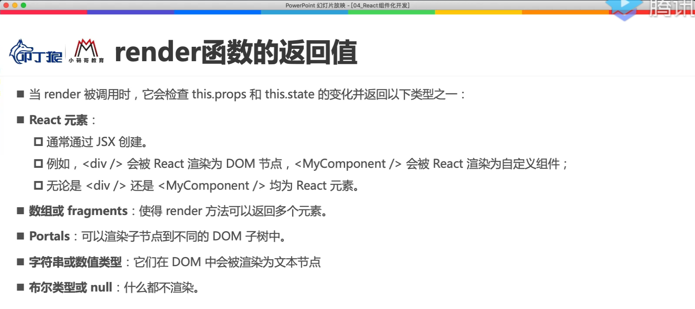
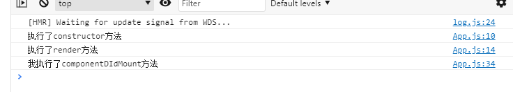
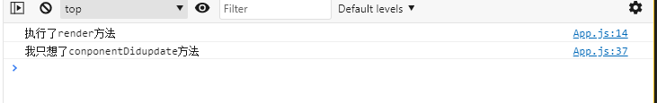
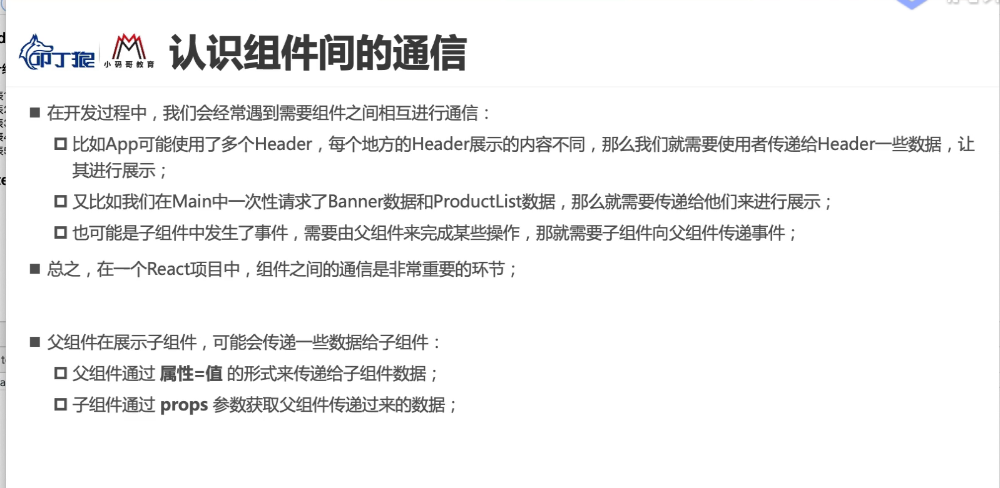
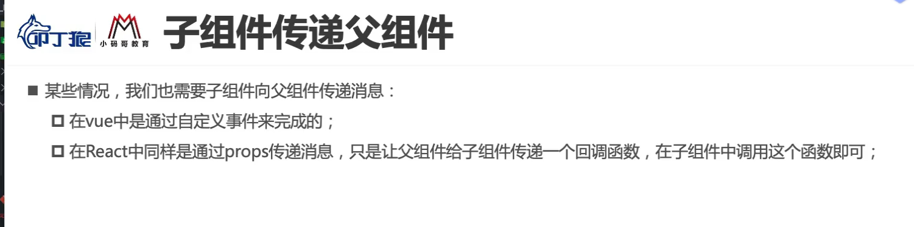

## 邂逅React开发

学习课程具备的基础:

- HTMl,CSS,JS(ES6以上)

### React是什么

> 接触过React的人都对他有一些印象

==用于构建用户界面的JavaScript库==

对于WEB前端来说,重要任务是构建用户界面,构建用户界面离不开三个技术:

- HTML:构建页面的结构
- CSS:构建页面的样式
- Javascript:页面动态内容和交互


### 常见的JavaScript库

> 一直以来前端开发人员都在需求可以让自己开发更方便的JavaScript库

- 在以前很久时间内,JQuery是被使用最多的JavaScript库
- 一份调查中,全球前10000个访问最高的网站,有65%使用JQuery,当时最受欢迎的JavaScript库
- 慢慢越来越多的公司不再使用JQuery,包括程序员使用最多的Github


### 目前前端领域最为流行的三大框架:

- React
- Vue
- Angular


### React的起源


### React的声明式编程

声明式编程:

- 声明式编程是目前整个大前端开发的模式:Vue,React,Flutter,SwiftUI
- 允许我们只需要维护自己的状态,当状态改变时,React根据最新的状态去渲染我们的UI界面


### React特点

> 详细了解参考PPT

- 组件化
- 多平台适配
- 掌握先进的思想和技术
- 在国内被广泛应用


## React

原生开发

```html
<!DOCTYPE html>
<html lang="en">

<head>
  <meta charset="UTF-8">
  <meta name="viewport" content="width=device-width, initial-scale=1.0">
  <title>Document</title>

</head>

<body>
  <h2 class="title"></h2>
  <button class="btn">改变文本</button>
  <script>
    //命令式编程:每做一个操作,都是给计算机(浏览器)一道道命令
    //声明式编程:
    //1.定义变量
    let message = "Hello World!!!"

    //2.将数据赋值给h2
    const titleEl = document.getElementsByClassName("title")[0];
    titleEl.innerHTML = message;

    //3.点击按钮,界面的数据发生改变
    const btnEl = document.getElementsByClassName("btn")[0]
    btnEl.addEventListener("click", e => {
      message = "Hello React!!!"
      titleEl.innerHTML = message
    })

  </script>
</body>

</html>
```

Hello React案例

```react
<!DOCTYPE html>
<html lang="en">

<head>
  <meta charset="UTF-8">
  <meta name="viewport" content="width=device-width, initial-scale=1.0">
  <title>Document</title>
  <!-- 添加React依赖 -->
  <script src="https://unpkg.com/react@16/umd/react.development.js" crossorigin></script>
  <script src="https://unpkg.com/react-dom@16/umd/react-dom.development.js" crossorigin></script>
  <script src="https://unpkg.com/babel-standalone@6/babel.min.js"></script>

</head>

<body>
  <div id="app"></div>
  <!-- 开始开发 -->
  <!-- 注意事宜:使用JSX,并且希望script中的jsx代码被解析,必须在script1中添加属性 -->
  <!-- JSX特点:多个标签最外层(根)只能有一个标签 -->
  <script type="text/babel">
    let message = "Hello World!!!"
    function btnclick() {
      message = "hello React!!!"
      render();
    }

    function render() {
      ReactDOM.render(
        <div>
          <h2>{message}</h2>
          <button onClick={btnclick}>改变文本</button>
        </div>,
        document.getElementById("app")
      )
    }

    render()
  </script>

</body>

</html>
```


React组件化开发

```react
<!DOCTYPE html>
<html lang="en">

<head>
  <meta charset="UTF-8">
  <meta name="viewport" content="width=device-width, initial-scale=1.0">
  <title>Document</title>
  <!-- 添加React依赖 -->
  <script src="https://unpkg.com/react@16/umd/react.development.js" crossorigin></script>
  <script src="https://unpkg.com/react-dom@16/umd/react-dom.development.js" crossorigin></script>
  <script src="https://unpkg.com/babel-standalone@6/babel.min.js"></script>

</head>

<body>
  <!-- 根节点 -->
  <div id="app"></div>

  <!-- 开始开发 -->
  <script type="text/babel">

    //封装App组件
    class App extends React.Component {
      constructor() {
        super();
        this.state = {
          message: "Hello World!!!"
        }
      }

      render() {
        return (
          <div>
            <h2>{this.state.message}</h2>
            <button onClick={this.btnclick.bind(this)}>改变文本</button>
          </div>
        )
      }

      btnclick() {
        this.setState({
          message: "Hello React!!!"
        })
      }
    }

    //渲染组件
    ReactDOM.render(<App />, document.getElementById("app"))
  </script>
</body>

</html>
```


### React组件化开发

创建react脚手架

> create-react-app 01_react_component

类组件

```react
import React, { Component } from 'react';

export default class App extends Component {
  render() {
    return (
      <div>
        <span>我是App组件</span>
        {/* alt + shift + f: 对代码进行格式化 */}
        <h2>{this.state.message}</h2>
      </div>
    )
  }
}
```


函数式组件：

>  * 函数式组件的特点:
>      *  1.没有this对象
>      * 2.没有内部的状态

```react
import React, { Component } from 'react';

export default function App() {
  return (
    <div>
      <span>我是function的组件: App组件</span>
      <h2>counter</h2>
      <button>+1</button>
      <h2>你好啊,王小波</h2>
    </div>
  )
}
```


Render返回值

小技巧：

> rcc = react class component



```react
import React, { Component } from 'react'

export default class App extends Component {
  render() {
    return (
      [
        <div>Hello World</div>,
        <div>Hello React</div>
      ]
    )
  }
}
```

```react
import React, { Component } from 'react'

export default class App extends Component {
  render() {
    return "aaaa"
  }
}

```


React的生命周期


生命周期第一阶段

```react
import React, { Component } from 'react'

export default class App extends Component {
  constructor() {
    super()

    this.state = {
      message: "我是文本"
    }
    console.log("执行了constructor方法");
  }
  render() {

    console.log("执行了render方法");
    return (
      <div>
        <h2>
          学习组件的生命周期函数
        </h2>
      </div>
    )
  }

  componentDidMount() {
    console.log("我执行了componentDIdMount方法");
  }
}
```




componentDidupdate函数

```react
import React, { Component } from 'react'

export default class App extends Component {
  constructor() {
    super()

    this.state = {
      message: "我是文本"
    }
    console.log("执行了constructor方法");
  }
  render() {

    console.log("执行了render方法");
    return (
      <div>
        <h2>
          学习组件的生命周期函数
        </h2>

        <p>{this.state.message}</p>
        <button onClick={e => this.changeText()}>切换文本</button>
      </div>
    )
  }

  changeText() {
    this.setState({
      message: '我是改变后的文本'
    })
  }

  componentDidMount() {
    console.log("我执行了componentDIdMount方法");
  }
  componentDidUpdate() {
    console.log("我只想了conponentDidupdate方法");
  }
}
```




末阶段

componentWillUnmount(销毁)

```react
import React, { Component } from 'react'

//组件案例
class Cpn extends Component {
  render() {
    return <h2>我是Cpn组件</h2>
  }

  //销毁
  componentWillUnmount() {
    console.log("调用了Cpn的componentWillUnmount方法");
  }
}

export default class App extends Component {
  constructor() {
    super()

    this.state = {
      message: "我是文本",
      isTrue: true
    }
    console.log("执行了constructor方法");
  }
  render() {

    console.log("执行了render方法");
    return (
      <div>
        <h2>
          学习组件的生命周期函数
        </h2>
				/*数据更新*/
        <p>{this.state.message}</p>
        <button onClick={e => this.changeText()}>切换文本</button>
        <hr />
        <button onClick={e => this.changeCpnShow()}>切换</button>
        {this.state.isTrue && <Cpn />}
      </div>
    )
  }

  changeText() {
    this.setState({
      message: '我是改变后的文本'
    })
  }

  changeCpnShow() {
    this.setState({
      isTrue: !this.state.isTrue
    })
  }

  componentDidMount() {
    console.log("我执行了componentDIdMount方法");
  }
  componentDidUpdate() {
    console.log("我只想了conponentDidupdate方法");
  }
}
```

>  PPT中介绍了在什么情况下使用什么生命周期方法


### React组件的嵌套

```react
import React, { Component } from 'react'

function Header() {
  return <h2>我是header</h2>
}

function Productlist() {
  return (
    <ul>
      <li>商品列表1</li>
      <li>商品列表2</li>
      <li>商品列表3</li>
      <li>商品列表4</li>
      <li>商品列表5</li>
    </ul>
  )
}

function Banner() {
  return (
    <div>
      <h2>woshibanerzujian</h2>
      <Productlist />
    </div>
  )
}

function Footer() {
  return <h2>woshiFooterzujian</h2>
}

export default class App extends Component {
  render() {
    return (
      <div>
        <Header />
        <Banner />
        <Footer />
      </div>
    )
  }
}
```


### React中父子通信--类组件



```react
import React, { Component } from 'react'

class ChildCpn extends Component {
  // constructor(props) {
  //   super();
  //   this.state = {}
  //   this.props = props
  // }

  render() {
    const { name, age } = this.props
    return (
      <div>
        <h2>子组件展示数据:{name + "" + age}</h2>
      </div>
    )
  }
}

export default class App extends Component {

  render() {
    return (
      <div>
        <ChildCpn name="budai" age="18" />
      </div>
    )
  }
}
```


函数式组件

```react
import React, { Component } from 'react'

function ChildCpn(props) {
  // 没有this的使用
  const { name, age } = props
  return (
    <h2>子组件展示数据:{name + "" + age}</h2>
  )
}

export default class App extends Component {
  render() {
    return (
      <div>
        <ChildCpn name="budai" age="18" />
      </div>
    )
  }
}
```


### React属性验证

```react
import React, { Component } from 'react';

import PropTypes from 'prop-types';

function ChildCpn(props) {
  const { name, age, height } = props;
  console.log(name, age, height);
  const { names } = props;

  return (
    <div>
      <h2>{name + age + height}</h2>
      <ul>
        {
          names.map((item, index) => {
            return <li>{item}</li>
          })
        }
      </ul>
    </div>
  )
}

class ChildCpn2 extends Component {
  // es6中的class fields写法
  static propTypes = {}

  static defaultProps = {}
}

ChildCpn.propTypes = {
  name: PropTypes.string.isRequired,
  age: PropTypes.number,
  height: PropTypes.number,
  names: PropTypes.array
}

ChildCpn.defaultProps = {
  name: "why",
  age: 30,
  height: 1.98,
  names: ["aaa", "bbb"]
}

export default class App extends Component {
  render() {
    return (
      <div>
        <ChildCpn name="why" age={18} height={1.88} names={["abc", "cba"]}/>
        <ChildCpn name="kobe" age={40} height={1.98} names={["nba", "mba"]}/>
        <ChildCpn/>
      </div>
    )
  }
}
```


### 子传父通信-函数调用



```react
import React, { Component } from 'react'

class Counterbutton extends Component {
  render() {
    const { dianji, name } = this.props;

    return (
      <div>
        <h2>{name}</h2>
        <button onClick={dianji}>dainjian</button>
      </div>
    )
  }
}

export default class App extends Component {
  constructor() {
    super()

    this.state = {
      counter: 0
    }
  }

  render() {
    return (
      <div>
        <h2>当前计数:{this.state.counter}</h2>
        <button onClick={e => this.innerment()}>jia1</button>

        <Counterbutton dianji={this.innerment.bind(this)} name="why" />
      </div>
    )
  }

  innerment() {
    this.setState({
      counter: this.state.counter + 1
    })
  }
}
```


三种改变this指向的方法

(一)

```react
import React, { Component } from 'react'

export default class App extends Component {
  constructor() {
    super()
    this.state = {
      message: "我是文本"
    }
  }
  render() {
    return (
      <div>
        <p>{this.state.message}</p>
        <button onClick={this.changeText()}>切换文本</button>
      </div>
    )
  }

  changeText= ()=> {
    this.setState({
      message: '我是改变后的文本'
    })
  }
}
```

(二)

```react
import React, { Component } from 'react'

export default class App extends Component {
  constructor() {
    super()
    this.state = {
      message: "我是文本"
    }
  }
  render() {
    return (
      <div>
        <p>{this.state.message}</p>
        <button onClick={e => this.changeText()}>切换文本</button>
      </div>
    )
  }

  changeText() {
    this.setState({
      message: '我是改变后的文本'
    })
  }
}
```

(三)

```react
import React, { Component } from 'react'

export default class App extends Component {
  constructor() {
    super()
    this.state = {
      message: "我是文本"
    }
  }
  render() {
    return (
      <div>
        <p>{this.state.message}</p>
        <button onClick={e => this.changeText()}>切换文本</button>
      </div>
    )
  }

  changeText() {
    this.setState({
      message: '我是改变后的文本'
    })
  }
}
```


### React实现Slot

> 一般情况下有两种方法

(一)

```react

```


(二)

```react

```


### 跨组件通信


### setState的使用

- 为什么使用setState?

  > 

```react
import React, { Component } from 'react'

export default class App extends Component {
  constructor(props) {
    super(props);

    this.state = {
      counter: 0
    }
  }
  render() {
    return (
      <div>
        <p>当前计数:{this.state.counter}</p>
        <button onClick={e => this.click()}>点击按钮</button>
      </div>
    )
  }

  click() {
    // 不能使用该种方法的原型
    this.state.counter += 1

    // this.setState({
    //   counter: this.state.counter + 1
    // })
  }
}
```


- setState是异步更新

  > 

```react
import React, { Component } from 'react'

// function Home(props) {
//   return <h1>{props.message}</h1>
// }

export default class App extends Component {
  constructor(props) {
    super(props);

    this.state = {
      message: 'Hello World'
    }
  }
  render() {
    return (
      <div>
        <p>当前计数:{this.state.message}</p>
        <button onClick={e => this.click()}>点击按钮</button>
        {/* <Home message={this.state.message}></Home> */}
      </div>
    )
  }

  click() {
    this.setState({
      message: "Hello React!!!"
    })
    //打印输出Hello world
    console.log(this.state.message);
  }
}
```

获取setState异步更新数据的几种方法

(一)回调函数

```js
click() {
    // 方式一: 获取异步更新后的数据
    // setState(更新的state, 回调函数)
    this.setState({
      message: "Hello React!!!"
    }, () => {
      console.log(this.state.message);
    })
  }
```

(二)生命周期

```js
componentDidUpdate() {
    // 方式二: 获取异步更新的state
    console.log(this.state.message);
  }
```


### setState改为同步更新的几种方法

(一)将setState放入到定时器中

```react
import React, { Component } from 'react'


export default class App extends Component {
  constructor(props) {
    super(props)

    this.state = {
      message: 'HelloWorld!!!'
    }
  }
  render() {
    return (
      <div>
        <h2>文本:{this.state.message}</h2>
        <button onClick={this.onclick.bind(this)}>点击切换</button>
      </div>
    )
  }

  onclick() {
    setTimeout(() => {
      this.setState({
        message: 'HelloReact!!!'
      })
      console.log(this.state.message)
    }, 0)
  }
}
```

(二)componentDidMount函数

```react
import React, { Component } from 'react'

export default class App extends Component {
  constructor(props) {
    super(props)

    this.state = {
      message: 'HelloWorld!!!'
    }
  }
  render() {
    return (
      <div>
        <h2>文本:{this.state.message}</h2>
        <button id="btn">生命周期(setState同步更新)</button>
      </div>
    )
  }

  componentDidMount() {
    document.getElementById("btn").addEventListener("click", e => {
      this.setState({
        message: 'HelloReact!!!'
      })
      console.log(this.state.message)
    })
  }
}

```

